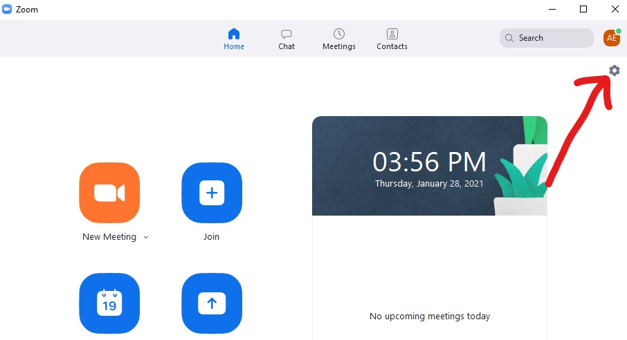
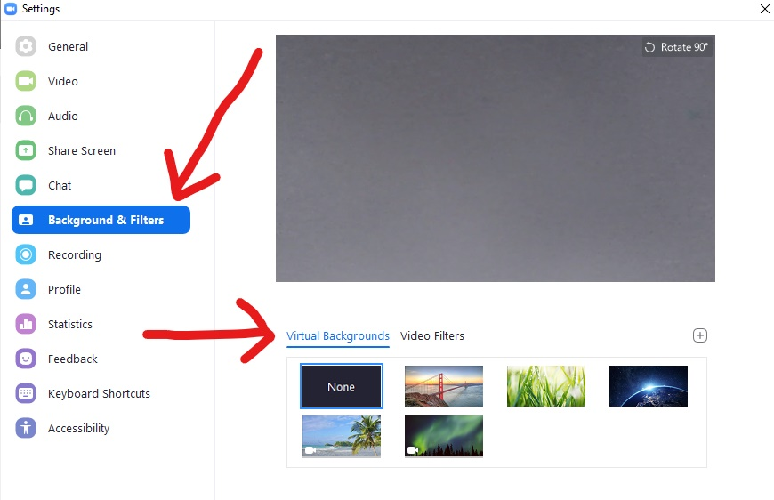
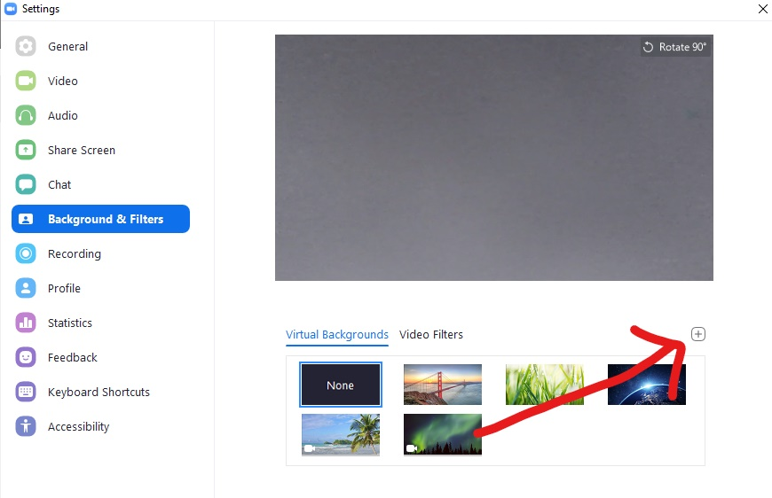

# How to use a custom video background on Zoom
---
## Introduction
Zoom is a powerful piece of software with many customization options that users do not take advantage of. The virtual background option on Zoom allows users to set a picture or video to appear in their backdrop during video calls.
## Instructions
### 1. Ensure that your Zoom client is up-to-date. 
* You can download the latest version [here](https://zoom.us/download#client_4meeting).
* Version 5.1.1 or greater is necessary to utilize the virtual  background functionality.
### 2. Open the Zoom application for desktop.
### 3. Navigate to account settings.
* Click the gear icon underneath your profile image in the top right of the window.
* Alternatively, click your profile image in the top right and select the "settings" option from the panel.
* If you have not set a profile picture, it will appear as a square with your initials.

### 4.  Select "Background & Filters".
* "Virtual Backgrounds" should be selected by default. If not, select the "Virtual Backgrounds" option.

### 5. Find a video you would like to use as your background.
* Zoom has a few video options that are available to select by default. These are the thumbnails with the camera icon in the bottom left. If you would like to use one of these videos, skip to the next step.
* If you are using your own video as a background, make sure it is a .mp4 file and store the file at some location on your computer. _Remember the file location as you will have to navigate to it in the next step._
* If you would like to use a file from YouTube, you can utilize a url-to-mp4 tool such as [this one](https://onlinevideoconverter.party/) to download the video onto your computer.
### 6. Add the video to your virtual background library
* Select the add button (with the plus icon) and then choose add video.
* Navigate to the file path that you saved your video at, select the video, and click "open".
* If a popup window asks you to download the smart virtual background package, select download.

### 7. Enable your virtual background
* Click the thumbnail of the video of your choice within the backgrounds and filters settings. To set no virtual background, select the thumbnail that says "none".
* Sign out of your account and sign back in for the virtual background to be enabled.
* For the best results, make sure you set up your camera in front of a plain wall durring Zoom meetings.